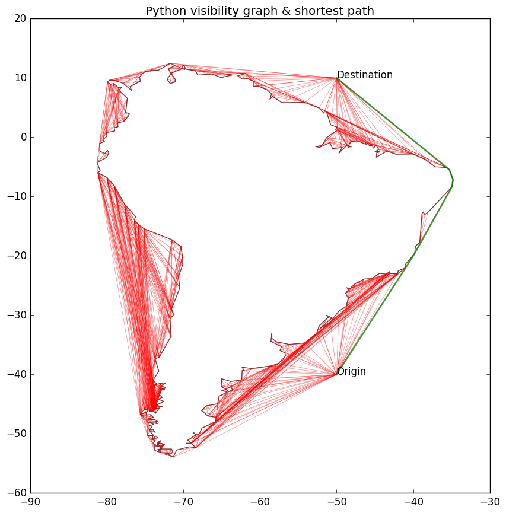

# Pyvisgraph - Python Visibility Graph

[](/LICENSE.txt)


Given a set of simple obstacle polygons, build a visibility graph and find
the shortest path between two points.



Pyvisgraph is a MIT-licensed Python package for building visibility graphs from
a set of simple obstacle polygons. The visibility graph algorithm (D.T. Lee)
runs in O(n^2 log n) time. The shortest path is found using Djikstra's
algorithm.

## Requirements
* Python >=2.6
* Pyshp (for reading shapefiles)

## Installing Pyvisgraph
Pyvisgraph has not been released yet, so for now it can only be forked.

## Usage
Here is an example of building a visibility graph given a list of
simple polygons:
```
>>> from vis_graph.vis_graph import VisGraph
>>> from vis_graph.graph import Point
>>> polys = [[Point(0.0,1.0),Point(3.0,1.0),Point(1.5,4.0)],
>>>          [Point(4.0,4.0),Point(7.0,4.0),Point(5.5,8.0)]]
>>> g = VisGraph()
>>> g.build(polys)
>>> shortest = g.shortest_path(Point(1.5,0.0), Point(4.0, 6.0))
>>> print shortest
[Point(1.50, 0.00), Point(3.00, 1.00), Point(4.00, 6.00)]
```
Once the visibility graph is built, it can be saved and subsequently loaded.
This is useful for large graphs where build time is long. `cPickle` is used
for saving and loading.
```
>>> g.save('graph.pk1')
>>> g2 = VisGraph()
>>> g2.load('graph.pk1')
```
For obstacles with a large number of points, Pyvisgraph can take advantage of
processors with multiple cores using the `multiprocessing` module. Simply
add the number of workers (processes) to the `build` method:
```
>>> g.build(polys, workers=4)
```
For more information about the implementation, see these series of articles:
* [Distance Tables Part 1: Defining the Problem](https://taipanrex.github.io/2016/09/17/Distance-Tables-Part-1-Defining-the-Problem.html)
* More to come...
